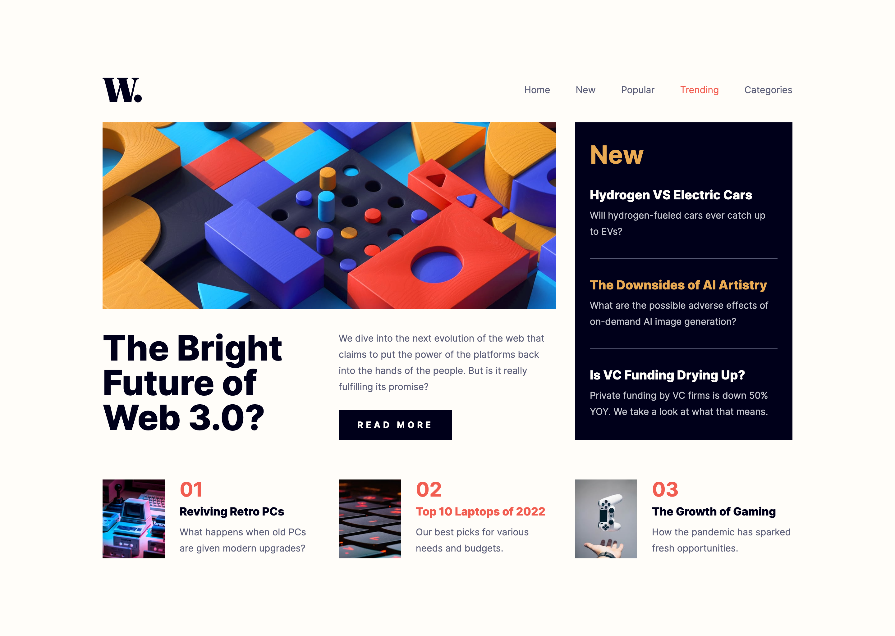

# Frontend Mentor - News homepage solution

This is a solution to the [News homepage challenge on Frontend Mentor](https://www.frontendmentor.io/challenges/news-homepage-H6SWTa1MFl). Frontend Mentor challenges help you improve your coding skills by building realistic projects.

## Table of contents

- [Overview](#overview)
  - [The challenge](#the-challenge)
  - [Screenshot](#screenshot)
  - [Links](#links)
- [My process](#my-process)
  - [Built with](#built-with)
  - [What I learned](#what-i-learned)
  - [Continued development](#continued-development)
  - [Useful resources](#useful-resources)
- [Author](#author)

## Overview

### The challenge

Users should be able to:

- View the optimal layout for the interface depending on their device's screen size
- See hover and focus states for all interactive elements on the page

### Screenshot

|          Mobile designed at 375px:           |           Desktop designed at 1440px:           |
| :------------------------------------------: | :---------------------------------------------: |
|      |        |
|             Mobile (completed):              |              Desktop (completed):               |
|  |  |

### Links

- Solution URL: [https://github.com/elisilk/news-homepage](https://github.com/elisilk/news-homepage)
- Live Site URL: [https://elisilk.github.io/news-homepage/](https://elisilk.github.io/news-homepage/)

## My process

### Built with

- Semantic HTML5 markup
- CSS custom properties
- Flexbox
- CSS Grid
- Mobile-first workflow
- Fluid typography
- Accessibility

### What I learned

Hmm 🤔 ...

- [Every Layout](https://every-layout.dev/) - So many useful layout techniques throughout this resource.
  - [The Switcher](https://every-layout.dev/layouts/switcher/) - for the popular section
  - [The Sidebar](https://every-layout.dev/layouts/sidebar/) - for the main section with the new section as the sidebar to the highlight section
- [Document: scroll event](https://developer.mozilla.org/en-US/docs/Web/API/Document/scroll_event)
- [Using CSS counters](https://developer.mozilla.org/en-US/docs/Web/CSS/CSS_counter_styles/Using_CSS_counters) - For the popular section item numbers, I replaed static/hard-coded values with a CSS counter. Kevin Powell's [Dynamic numbering with CSS counters](https://youtu.be/tnSzkAiiQ4w?si=OzzluJ9yBpA0-21X) video was super helpful.
- [Using HTML landmark roles to improve accessibility](https://developer.mozilla.org/en-US/blog/aria-accessibility-html-landmark-roles/) - Made sure to use semantic HTML and to explicitly label each of the major region landmarks used in the design.
- [CSS Box Shadow Bottom Only](https://stackoverflow.com/questions/4561097/css-box-shadow-bottom-only)

### Continued development

Specific areas that the solution should be improved (known issues):

- [Cards - Inclusive Components](https://inclusive-components.design/cards/) - Improve the card component, in particular, so that the entire card is interactive (on hover, focus, etc.).
- Potentially animate the appearance of the mobile navigation menu.
- [Include a "skip to main content" link?](https://www.a11y-collective.com/blog/skip-to-main-content/)

- Implement the suggestion from @bccpadge:

```html
<button aria-expanded="false" aria-controls="nav">
  <span class="visually-hidden">Open mobile navigation</span>
  
  
</button>
```

More general ideas I want to consider:

Hmm 🤔 ...

- [Designing Beautiful Shadows in CSS](https://www.joshwcomeau.com/css/designing-shadows/) by Josh Comeau - I definitely want to learn more about shadows and how to create them myself, so they are subtle and appropriate for the task. Right now, it feels like I am just copying the design or someone else's code and I don't know how to figure out what is best myself.

### Useful resources

- [Accessibility Developer Guide](https://www.accessibility-developer-guide.com/)
- [MDN Web Docs for CSS](https://developer.mozilla.org/en-US/docs/Web/CSS) - Went here a lot to reference the different CSS properties and the shorthands, and all the great explanations about best practices.
- [MDN Guides](https://developer.mozilla.org/en-US/docs/Learn)
- [The Clamp Calculator](https://royalfig.github.io/fluid-typography-calculator/) - Used for all of fluid typography and fluid spacing calculations.

## Author

- Website - [Eli Silk](https://github.com/elisilk)
- Frontend Mentor - [@elisilk](https://www.frontendmentor.io/profile/elisilk)
